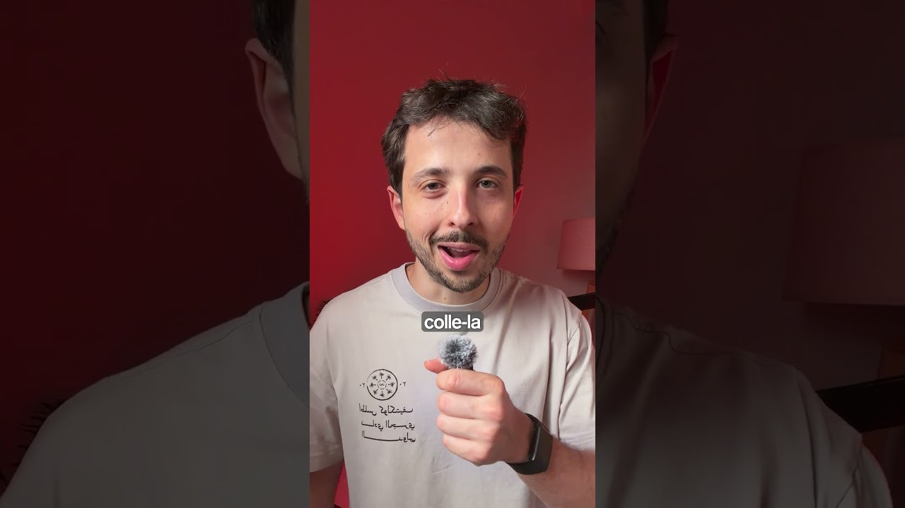
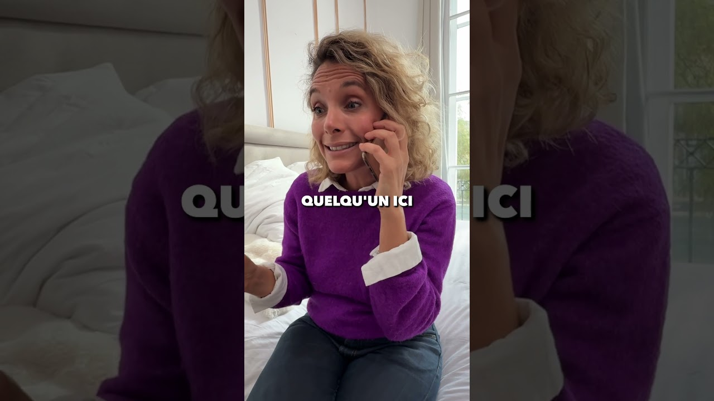

Page de démonstration du prototype d'encapsulation YouTube. À supprimer une fois
le rendu validé.

## Lien markdown classique (`watch?v=`)

[Martha Argerich joue Rachmaninov](https://www.youtube.com/watch?v=tE2Vf2uo7Z8)

## Short — forme que le plugin Quartz ne reconnaît pas

  
  ▶

## `youtu.be` avec emoji collé par le partage iOS

[Lien partagé depuis l'iPhone](https://youtu.be/cMeKHi9JEi4▶️)

## URL nue, sans lien markdown

  
  ▶

## Lien de chaîne — ne doit PAS être encapsulé

[La chaîne de David Abbasi](https://www.youtube.com/@DavidAbbasiMD)
